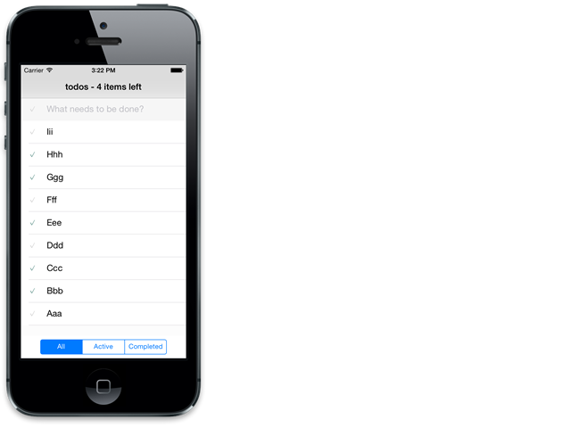

# TiTodoMVC

Titanium port like a [TastJS](http://tastejs.com/) [TodoMVC](http://todomvc.com/).

## Getting started

### If you want to clone from this repository

~~~
$ git clone git@github.com:k0sukey/TiTodoMVC.git
~~~

### If create from full scratch

#### Create Titanium project

~~~
$ ti create --platforms ios,android --id be.k0suke.titodomvc --name TiTodoMVC --workspace-dir ./
~~~

#### Create Alloy project

~~~
$ cd TiTodoMVC
$ alloy new
~~~

#### Dependencies ti-commonjs, and loadsh, moment under the ti-commonjs

~~~
$ npm install ti-commonjs --prefix ./app/lib
$ npm install --prefix ./app/lib lodash moment
~~~

#### Make views platform folders

~~~
$ mkdir ./app/views/ios
$ mkdir ./app/views/android
~~~

#### Enjoy coding!

## Feature

* Create todo
* Edit todo, do double tap
* Delete todo, do swipe
* Toggle todo(s), tap the check mark
* All/Active/Completed filter

## Changelog

* Released iOS ver

## License

The MIT License (MIT) Copyright (c) 2013 Kosuke Isobe
